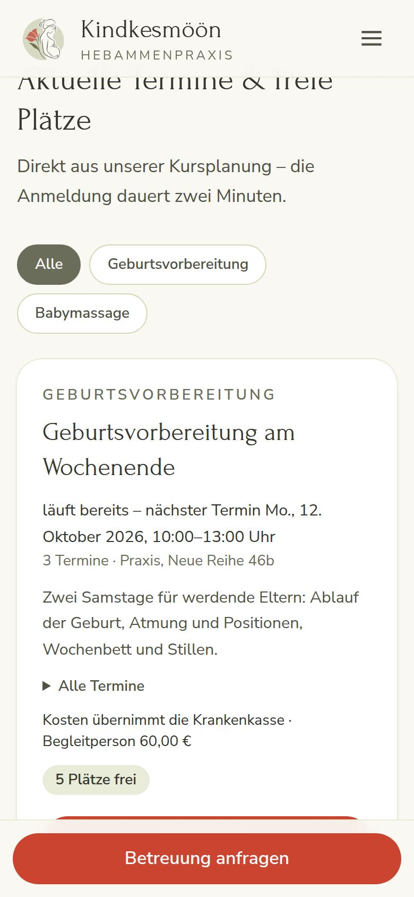
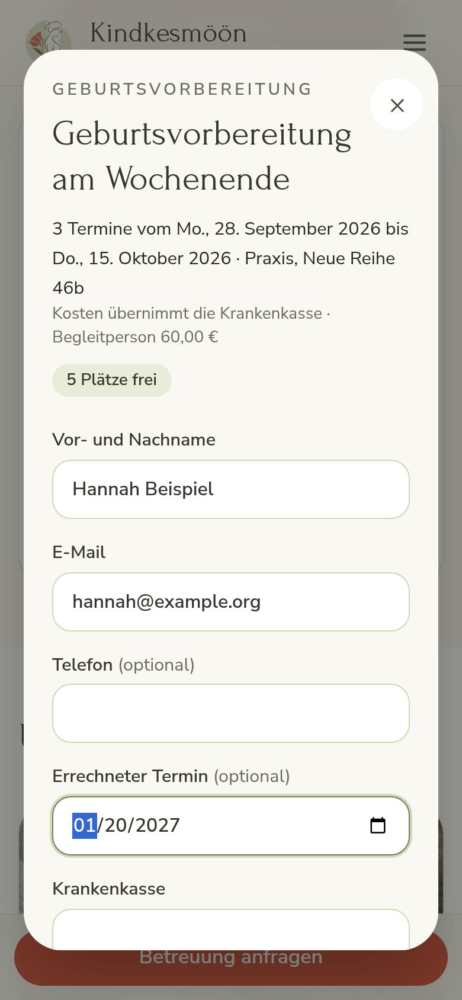
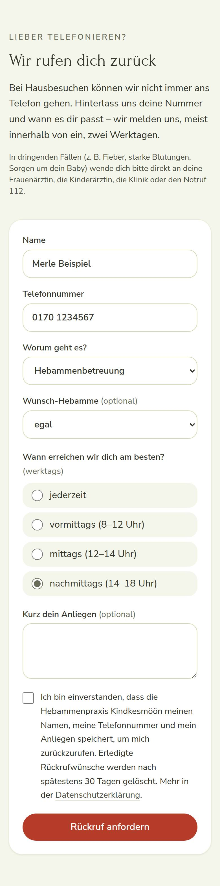
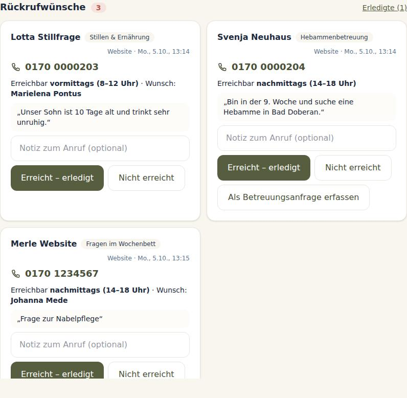

# Website der Hebammenpraxis Kindkesmöön

Öffentliche Website, gebaut mit [Astro](https://astro.build) als statische Seiten. Getrennt von der Praxis-App: keine Datenbank, keine Cookies, kein Tracking, Schriften lokal.

Vorschau: [Desktop](../../docs/website/vorschau-desktop.jpg) · [Handy](../../docs/website/vorschau-handy.jpg)

## Entwickeln

```bash
npm run dev:website                     # http://localhost:4321 (im Codespace startet sie automatisch, Port 4321)
npm run build:website                   # prüft (astro check) und baut nach apps/website/dist
```

Beim Entwickeln holt die Website Kurse, Kapazität und Team-Status von der eigenen Adresse; der Dev-Server leitet `/api/oeffentlich/…` an die App auf `http://localhost:3000` weiter (anderes Ziel: `PUBLIC_APP_URL=…`). Das funktioniert auch im Codespace, wo `localhost:3000` im Browser nicht erreichbar ist. Erst im Build (Betrieb) lädt der Browser direkt von `PUBLIC_APP_URL`; die App erlaubt das per CORS nur für `WEBSITE_URL` (außerhalb der Produktion zusätzlich `http://localhost:4321`).

## Inhalte ändern

| Was | Wo |
|---|---|
| Team, Leistungen, Kurse, Betreuungsgebiet, Fragen, Stimmen, Zeitstrahl, Praxisdaten | `src/inhalte/praxis.ts` |
| Seitenaufbau | `src/pages/*.astro` |
| Farben, Schriften | `src/styles/global.css` (Farben der bisherigen Wix-Seite: Salbei, Mohn, Sand) |
| Bilder | `src/assets/bilder/` (werden beim Bauen automatisch verkleinert und als WebP ausgeliefert); Nachweise in `src/inhalte/bildnachweise.json` |
| Impressum, Datenschutz | `src/pages/impressum.astro`, `src/pages/datenschutz.astro` – **Entwürfe**, vor dem Livegang ergänzen und prüfen |

Platzhalterbilder (Unsplash-Lizenz) nach und nach durch eigene Fotos ersetzen: Datei in `src/assets/bilder/` ablegen, in `praxis.ts` bzw. der Seite importieren und den Eintrag in `bildnachweise.json` anpassen. Personen auf Platzhalterbildern dürfen nicht als Team oder Klientinnen ausgegeben werden.

## Live-Daten aus der App

- **Kurse:** `src/komponenten/KursListe.astro` lädt `GET {PUBLIC_APP_URL}/api/oeffentlich/kurse` (ohne Personendaten); die Anmeldung läuft direkt auf der Website in einem Dialog und schickt `POST {PUBLIC_APP_URL}/api/oeffentlich/kurse/<id>/anmeldung` (Einwilligung, Honigtopf, Begrenzung je IP; doppelte Anmeldung mit derselben E-Mail legt nichts neu an). Direktlink auf einen Kurs: `/kurse?kurs=<id>`. Auf der Seite „Kurse“ gibt es einen Filter nach Kursart und darunter das Kalender-Abo der Kurstermine (`GET {PUBLIC_APP_URL}/api/oeffentlich/kurse.ics`, `webcal://`, ohne Personendaten).

   
- **Betreuungsanfrage (M11):** `src/komponenten/AnfrageFormular.astro` sendet an `POST {PUBLIC_APP_URL}/api/oeffentlich/anfrage` (Einwilligung, Honigtopf, 5 je Stunde und IP); ohne JavaScript erscheint der Weg per E-Mail/Telefon.
- **Rückrufwunsch:** `src/komponenten/RueckrufFormular.astro` (Kontaktseite, Anker `#rueckruf`) sendet an `POST {PUBLIC_APP_URL}/api/oeffentlich/rueckruf` (Name, Telefon, Anliegen, Zeitfenster, Wunsch-Hebamme; Einwilligung, Honigtopf, 5 je Stunde und IP). In der App erscheint er im Cockpit und auf der Seite „Anfragen“.

   
- **Rufbereitschaft und Abwesenheiten (M19):** dieselbe Schnittstelle liefert `rufbereitschaft` (Namen für heute) und je Hebamme `abwesendBis` (ohne Grund); angezeigt in `[data-rufbereitschaft]` (Kontakt) und in den `data-team-status`-Elementen („bis … nicht erreichbar“).
- **Kapazitätsampel und Team-Status (M11):** `src/komponenten/Kapazitaet.astro` und `src/skripte/praxis-status.ts` lesen `GET {PUBLIC_APP_URL}/api/oeffentlich/praxis` (nur Stufe je Monat und Babypause-Status, keine Zahlen, keine Familien); Elemente mit `data-team-status="Name"` werden aktualisiert.

## Betrieb

`Dockerfile.website` baut die Seiten und liefert sie mit Caddy aus (`deploy/website.Caddyfile`, inklusive 301-Weiterleitungen der alten Wix-Adressen). Einrichtung: `docs/BETRIEB.md`, Abschnitt 6b.
