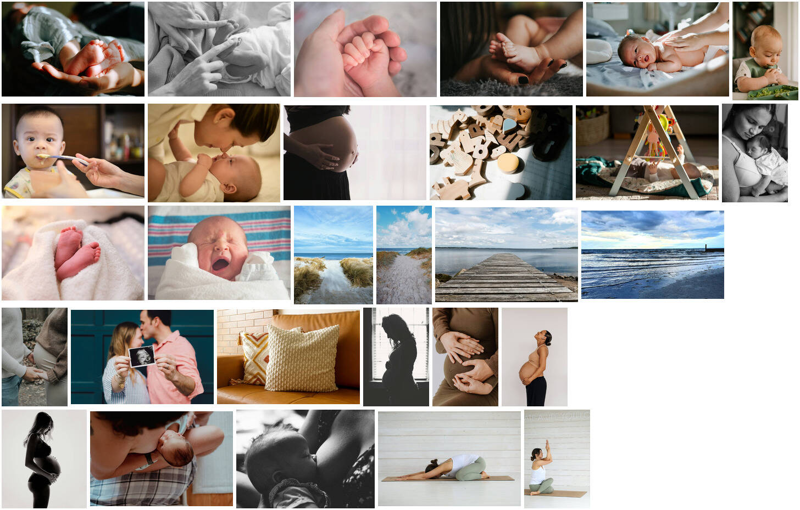

# Website Hebammenpraxis Kindkesmöön – Recherche für den Neubau

Bestandsaufnahme der aktuellen Website [hebammen-landkreisrostock.de](https://www.hebammen-landkreisrostock.de/) (Stand 05.10.2026) als Grundlage für die neue Website. Diese soll im Repo liegen, aber getrennt von der App laufen, etwa als `apps/website`.

**Inhalt:**

1. [Überblick](#1-überblick)
2. [Inhalte je Seite](#2-inhalte-je-seite)
3. [Kontaktformular](#3-kontaktformular)
4. [Gestaltung](#4-gestaltung)
5. [Eigene Fotos der Praxis](#5-eigene-fotos-der-praxis)
6. [Auffälligkeiten und Verbesserungen](#6-auffälligkeiten-und-verbesserungen)
7. [Vorschlag für die neue Website](#7-vorschlag-für-die-neue-website)
8. [Platzhalterbilder (frei nutzbar)](#8-platzhalterbilder-frei-nutzbar)

---

## 1. Überblick

| | |
|---|---|
| **System** | Wix (Websitebaukasten); Bilder auf `static.wixstatic.com`, Wix-Cookies, Google Fonts |
| **Domain** | `www.hebammen-landkreisrostock.de` |
| **Social Media** | Instagram [@hebammenpraxis_kindkesmoen](https://www.instagram.com/hebammenpraxis_kindkesmoen) |
| **Presse** | [Ostsee-Zeitung: „Schwanger in Bad Doberan: Hebammen eröffnen neue Praxis Kindkesmöön“](https://www.ostsee-zeitung.de/lokales/rostock-lk/bad-doberan/schwanger-in-bad-doberan-hebammen-eroeffnen-neue-praxis-kindkesmoeoen-F4U2SBJHN5C4LCEMYCW5475AMA.html) (auf der Startseite verlinkt) |

**Seiten und Menü** (Menüpunkt in Klammern):

| Adresse | Seite | Seitentitel (SEO) |
|---|---|---|
| `/` | Startseite („Hebammenpraxis Kindkesmöön“) | Hebammenpraxis Kindkesmöön in Bad Doberan |
| `/hebammen-team` | Die Hebammen | Hebammenpraxis Kindkesmöön – Die Hebammen |
| `/general-clean` | Die Praxis | Die Praxis \| Kindkesmöön |
| `/hebammenbetreuung-leistungen` | Leistungen | Leistungen Hebammenpraxis Kindkesmöön |
| `/kopie-von-leistungen` | Kurse | (Titel der Leistungsseite übernommen) |
| `/hebammenpraxis-kontakt` | Kontakt | Kontakt \| Hebammenpraxis Kindkesmöön |
| `/impressum`, `/datenschutz`, `/cookies` | Rechtliches | – |

**Meta-Beschreibungen:**

- **Startseite:** „Hebammenpraxis Kindkesmöön – Hebammenbetreuung in Bad Doberan und Umgebung, sowie dem Landkreis von Rostock, in Schwangerschaft und im Wochenbett, diverse Kursangebote“
- **Team:** „… Die Hebammen – Lorina Duwe, Marielena Pontus und Johanna Mede“
- **Kontakt:** „… auf der Suche nach deiner Hebamme? Dann melde dich gerne über das Kontaktformular bei uns.“

**Wiederkehrender Fußbereich** auf allen Seiten:

> „Hebammenbetreuung in Bad Doberan & dem Landkreis Rostock: Schwangerschaftsvorsorge · Schwangerschaftsmassage · Wochenbettbetreuung · Geburtsvorbereitungskurse · Babymassagekurse · Eltern-Kind-Kurse · Akupunktur · Kinesio-Taping“

Darunter die Links Kontakt · Impressum · Datenschutz · Cookies.

**Ansprache:** durchgehend „du“ bzw. „euch“, warm und persönlich.

---

## 2. Inhalte je Seite

Die Texte sind wörtlich übernommen. Offensichtliche Tippfehler sind in Abschnitt 6 gesammelt und hier nicht korrigiert.

### 2.1 Startseite

**Überschrift:** Hebammenpraxis Kindkesmöön

**Unterzeile:** liebevoll und geborgen begleitet

**Adresse:** Neue Reihe 46b, 18209 Bad Doberan

**Namenserklärung:**
> Kindkesmöön ist ein plattdeutscher Ausdruck, der sich aus den Begriffen „Kindkes“ für „Baby“ und „Möön“ für „Tante“ zusammensetzt. Im norddeutschen Raum nannte man Hebammen unter anderem so und erzählte den Kindern über sie, sie würden die Babys bringen. So fragten viele Kinder bei dem Wunsch nach einem Geschwisterchen, ob denn nicht bald die liebe Kindkesmöön kommen könne.

**Betreuungsgebiete:**
Bad Doberan, Börgerende-Rethwisch, Rostock, Nienhagen, Elmenhorst-Lichtenhagen, Admannshagen-Bargeshagen, Sievershagen, Lambrechtshagen, Bartenshagen-Parkentin, Kritzmow, Stäbelow, Satow, Retschow, Jürgenshagen, Hohenfelde, Kröpelin, Boldenshagen, Reddelich, Steffenshagen, Wittenbeck, Heiligendamm & Umgebung.

> Du bist unsicher ob wir in deiner Gegend unsere Betreuung anbieten? Dann melde dich gerne über das Kontaktformular.

### 2.2 Die Hebammen

| Name | Angabe | Telefon | E-Mail |
|---|---|---|---|
| Lorina Gosemann | Hebamme, „aktuell in Babypause“ | – | hebamme.lorinaduwe@gmail.com |
| Marielena Pontus | Hebamme | 0157 38386217 | hebamme.marielena@outlook.de |
| Johanna Mede | Hebamme | 0157 54781800 | hebamme.johannamede@gmail.com |

**Über uns:**
> Im Jahr 2014 begannen wir gemeinsam unsere Hebammenausbildung und schlossen diese im Jahr 2017 mit dem Examen ab. Bereits während der Ausbildung entstand der Wunsch Schwangere, Mütter und Familien ganzheitlich, liebevoll und kompetent zu betreuen. Wir sind empathische Hebammen, die einen Fokus auf jede einzelne Familiensituationen legen und somit eine individuelle Betreuung gewährleisten. Wir möchten euch als Eltern unterstützen, euren eignen Weg zu finden und euch in dieser besonderen Zeit stärken. Dabei arbeiten alle Hebammen evidenzbasiert und bilden sich regelmäßig fort.

**Stimmen von Familien:**

- **M. R.:** „Ich werde seit einigen Wochen von der Hebamme Marielena betreut. Am Wochenende haben mein Mann und ich am Geburtsvorbereitungskurs teilgenommen. Der Kurs wurde von Marielena und Lorina durchgeführt. Es war sehr informativ, eine angenehme Atmosphäre und beide sind sehr kompetente, liebe junge Frauen. Die Praxis wurde neu eröffnet und ist sehr liebevoll eingerichtet. Mein Mann und ich freuen uns sehr auf die weiteren gemeinsamen Monate.“
- **S. S.:** „Ich hatte am Wochenende den Geburtsvorbereitungkurs. Beide Tage waren informativ, praxisnah, herzlich und wertfrei gestaltet. Ich hab mich sehr wohl gefühlt. Absolute Weiterempfehlung!“
- **S. V.:** „Ich persönlich finde diese Praxis einen magischen Ort wo die Liebe zum Beruf zu spüren ist. Die Eröffnungsfeier fühlte sich sehr familiär an und hatte so einen tollen Charme. Würde ich noch ein Kind erwarten, würde diese Praxis meine erste Anlaufstelle!“

### 2.3 Die Praxis

> Unsere schöne Hebammenpraxis liegt in fußläufiger Entfernung zum Marktplatz von Bad Doberan. Die Praxis verfügt über einen großen, hellen Kursraum und ein gemütliches Behandlungszimmer, in dem sich Schwangere, Mütter und Babys wohlfühlen und geborgen sein können.
>
> In der Nähe der Praxis befindet sich ein idyllischer Angelteich mit Grünfläche, Sitzplätzen und einem Spielplatz. Viele Familien nutzen diesen Bereich gerne, um nach den Kursen gemeinsame Zeit zu verbringen.
>
> Ihr findet unsere Hebammenpraxis Kindkesmöön in der Neuen Reihe 46b, 18209 Bad Doberan. Parkplätze sind in unmittelbarer Nähe des Hofgeländes zu finden.

Dazu eine Bildergalerie mit eigenen Fotos (siehe Abschnitt 5).

### 2.4 Leistungen

| Leistung | Text |
|---|---|
| **Schwangerschaftsvorsorge** | Die Schwangerschaftsvorsorge wird durch die Mutterschaftsrichtlinien geregelt und kann sowohl von einem Gynäkologen, als auch von Hebammen durchgeführt werden. Auch ein Wechselmodell ist möglich. Gerne begleiten wir, wenn gewünscht, auch deine Schwangerschaft und untersuchen und beraten dich im Verlauf. |
| **Wochenbettbetreuung** | Das Wochenbett ist eine besondere und sensible Phase im Leben einer Frau. Wir unterstützen euch in dieser Phase mit unserem Wissen, achten auf einen natürlichen und gesunden Verlauf und begleiten euch als werdende Familie – immer mit einem gutem Blick auf euer Baby und euren Körper. |
| **Kurse** | Wir bieten in unserer Praxis verschiedene Kurse an. Dazu zählen Geburtsvorbereitungskurse, Rückbildungsgymanstik, Babymassagekurse sowie Krabbel- und Spielgruppen. Jeder einzelne Kurs soll euch wichtige Informationen geben, sowie Tipps und Tricks für die Schwangerschaft, das Wochenbett und das erste Lebensjahr mit eurem Baby. |
| **Hilfe bei Beschwerden** | Als Hebammen sind wir dazu ausgebildet mit natürlichen oder speziellen Maßnahmen deine physiologischen Beschwerden in der Schwangerschaft und im Wochenbett zu begleiten und im Idealfall zu lindern. |
| **Beikostberatung** | Die Beikostberatung ist wichtiger Bestandteil der Hebammenarbeit. Wann ist der richtige Zeitpunkt mit der Beikost zu starten, welche Art der Beikost eignet sich am besten für mein Baby und worauf muss ich achten? Bei Bedarf können wir dich zu diesem Thema beraten. |
| **Individuelle Leistungen** | Jede Hebamme bietet individuelle Zusatzleistungen an. So können wir ganzheitlich betreuen und bei Bedarf an eine andere Hebamme weiterleiten. Zu den individuellen Leistungen zählen: Akupunktur, Kinesio-Taping, Homöopathie, Schwangerschaftsmassage und Trageberatung. |

### 2.5 Kurse

**Ankommen im Leben – Geburtsvorbereitung intensiv**
> In diesem Kurs erfährst du alles Wichtige über den Verlauf der Schwangerschaft, die verschiedenen Phasen der Geburt und die erste Zeit nach der Entbindung. Durch das vermittelte Wissen, sowie praktische Übungen wollen wir euer Selbstvertrauen stärken und euch optimal auf eure Geburt und die erste Zeit mit eurem Baby vorbereiten.

Kursdetails:
- Wochenendkurs, jeweils von 10 bis 14:45 Uhr
- Kosten: für die Schwangeren von den Kassen übernommen; Teilnahmegebühr für die Begleitperson 130 Euro (durch die meisten Kassen erstattbar)
- „nächste Kursdaten: 14./15.02, 14./15.03, 09./10.05“

**Sanfte Hände – Babymassage für Wohlbefinden**
> In diesem Kurs lernst du, wie du durch sanfte Berührungen die Gesundheit und das Wohlbefinden deines Babys fördern kannst. In entspannter Umgebung erlernst du Techniken, die eure Bindung stärken und die Entwicklung deines Babys unterstützen können. Dabei zeigen wir euch auch Handgriffe, die bei Schlafproblemen und Koliken positiv wirken können. Dieser Kurs eignet sich für Eltern mit Babys im Alter von 8 Wochen bis 6 Monaten.

**Krabbelkiste – Spiel und Spaß für Groß & Klein** (aktuell pausiert)
> Willkommen in der „Krabbelkiste“ – Dieser Kurs richtet sich an Eltern mit ihren Babys im Alter von 7 bis 11 Monaten und bietet eine wunderbare Gelegenheit die Welt spielerisch zu entdecken. Das Kurskonzept greift Elemente der Montessori und Pikler Pädagogik auf und fördert durch eine vorbereitete Umgebung die Selbstständigkeit und das Selbstvertrauen. Die Kinder bekommen die Möglichkeit ihre eigenen Fähigkeiten zu erkunden und weiterzuentwickeln.

**Schwangerschaftsyoga** (externe Kursleiterin)
> Schwangerschaftsyoga wird in regelmäßigen Abständen in unseren Kursräumen durch Stephanie Oretzki durchgeführt. Für weitere Informationen schaut gerne auf ihrer Webseite vorbei.

Link: [ostseeyoga-mv.de](http://ostseeyoga-mv.de/index.php)

### 2.6 Kontakt

> Du bist interessiert an einer Betreuung oder einem Kurs? Melde dich gerne bei einer der Hebammen oder über das Kontaktformular. Wir freuen uns über deine Anfrage und melden uns innerhalb von ein paar Tagen bei dir zurück.

Das Formular ist in Abschnitt 3 beschrieben. Bestätigung nach dem Absenden: „Vielen Dank für deine Anfrage!“

### 2.7 Impressum

- **Adresse der gemeinsam genutzten Räumlichkeiten:** Neue Reihe 46b, 18209 Bad Doberan
- **Aufsichtsbehörde:** Gesundheitsamt Rostock
- **Berufsrechtliche Regelungen:** www.hebammengesetz.de
- **Hebammengebührenordnung:** GKV-Spitzenverband, Vergütungsverzeichnis für Hebammen
- **Verantwortliche:**
  - Hebamme Johanna Mede (hebamme.johannamede@gmail.com)
  - Hebamme Lorina Duwe (hebammelorina@gmail.com)
  - Hebamme Marielena Pontus (hebamme.marielena@outlook.de)
- **Umsatzsteuer:** Nach § 4 Nr. 14 UStG sind Hebammen von der Umsatzsteuer befreit, daher wird keine Umsatzsteuer ausgewiesen.
- **Urheberrecht:** Alle Inhalte dieser Webseite, insbesondere Texte, Fotografien und Grafiken, sind urheberrechtlich geschützt.

### 2.8 Datenschutz und Cookies

- **Datenschutz:** Musterdatenschutzerklärung. Sie behandelt die verantwortliche Stelle, Betroffenenrechte, SSL/TLS, Widerspruch gegen Werbe-Mails, Cookies, Server-Logfiles und **Google Web Fonts**, die extern von Google geladen werden. Wix und das Kontaktformular werden nicht ausdrücklich behandelt.
- **Cookie-Richtlinie:** Wix-Standardtext („Was ist ein Cookie?“, Übersicht, Optionen, Links zu Browser-Anleitungen).

---

## 3. Kontaktformular

Das heutige Wix-Formular „Anfrage“ hat diese Felder:

| Feld | Pflicht |
|---|---|
| Vorname, Nachname | ja (laut Wix-Kennzeichnung) |
| E-Mail, Telefon | – |
| Adresse + Postleitzahl | – |
| (voraussichtlicher) Entbindungstermin (Datumsauswahl) | ja |
| „Tätigkeit“ (vermutlich ein Überbleibsel aus der Wix-Vorlage) | – |
| Nachricht | – |
| Häkchen „I agree to the terms & conditions“ (englisch!) | ja |

Die Anfragen landen heute vermutlich als Wix-Benachrichtigung per E-Mail. Mit der neuen Website gehen sie als **Betreuungsanfrage direkt in die App** (M11), siehe Abschnitt 7.

---

## 4. Gestaltung

**Logo:** Strichzeichnung einer Schwangeren mit roter Mohnblume auf salbeigrünem Halbkreis, Schriftzug „KINDKESMÖÖN“ im Bogen. In der App liegt es schon als `apps/web/public/logo.png`.

**Farben der Wix-Seite:** Salbei und Oliv, Terrakotta bzw. Mohnrot, Sand. Das passt zu den Farben der App (`salbei`, `tulpe`, `sand`).

| Rolle | Farbwerte (RGB → Hex) |
|---|---|
| Salbei hell bis dunkel | 233,236,216 `#E9ECD8` · 211,217,180 `#D3D9B4` · 158,163,135 `#9EA387` · 106,109,90 `#6A6D5A` · 53,54,45 `#35362D` |
| Terrakotta / Mohn | 237,185,177 `#EDB9B1` · 220,147,136 `#DC9388` · 202,68,48 `#CA4430` · 135,45,32 `#872D20` |
| Sand | 237,232,216 `#EDE8D8` · 190,186,173 `#BEBAAD` |

**Schriften:**
- **Überschriften:** „Forum“ (Google Fonts, frei, OFL)
- **Fließtext:** „Avenir Light“ (lizenzpflichtige Wix-Schrift); Ersatz z. B. „Nunito Sans“ oder „Mulish“ (beide frei)
- **Für die neue Website:** Schriften lokal einbinden statt von Google laden (Datenschutz). Die Kinderurkunde nutzt bereits „Dancing Script“ als Schmuckschrift.

---

## 5. Eigene Fotos der Praxis

Die alte Website zeigt neben Wix-Stockbildern eigene Fotos. Sie sind für die neue Website **besser als jedes Stockfoto**: authentisch, regional, mit den echten Räumen.

| Motiv | Verwendung heute |
|---|---|
| Logo | alle Seiten |
| Gruppenfoto der drei Hebammen vor salbeigrüner Wand | Startseite / Team |
| Porträts Johanna, Marielena, Lorina (vor Backsteinwand mit Ranken) | Team |
| Behandlungszimmer (graues Sofa, Sessel, Teppich, Holzdielen, Fenster) | Praxis |
| Kursraum mit Fachwerk, Holzdielen, Matten und Lagerungskissen (zwei Ansichten) | Praxis |
| Deko-Detail (Windlicht, Figur einer Mutter, Pflanze) | Praxis |

**Empfehlung:** Die Originaldateien in voller Auflösung bei der Praxis anfragen, nicht die verkleinerten Wix-Kopien. Personenfotos kommen erst in die neue Website, wenn die Hebammen zugestimmt haben. Bis dahin halten die Platzhalter aus Abschnitt 8 die Stellen frei; für die Teamkarten eignen sich vorerst Initialen.

Die Wix-Stockbilder (Akupunktur, Stillen, „Doula“, Beikost, Yoga, Bauklötze) sind nur innerhalb von Wix lizenziert und dürfen **nicht** übernommen werden.

---

## 6. Auffälligkeiten und Verbesserungen

**Inhalt und Recht:**

- **Name Lorina:** Auf der Teamseite heißt sie „Gosemann“, in Impressum und Meta-Beschreibung „Duwe“. Auch die E-Mail-Adressen unterscheiden sich (`hebamme.lorinaduwe@gmail.com` bzw. `hebammelorina@gmail.com`). Das bitte vereinheitlichen.
- **Impressum unvollständig:** Es fehlen je Hebamme die ladungsfähige Anschrift (die gemeinsamen Räume reichen in der Regel nicht für jede Einzelne), die Berufsbezeichnung mit Staat der Verleihung („Hebamme, verliehen in Deutschland“), die zuständige Kammer bzw. Berufsvertretung und Telefonnummern. Die Verweise auf Hebammengesetz und Gebührenverzeichnis sollten richtige Links sein.
- **Datenschutzerklärung:** Mustertext, der Wix, das Kontaktformular (inklusive Entbindungstermin, also Gesundheitsdatum) und Instagram nicht behandelt. Google Fonts werden extern geladen; das ist rechtlich angreifbar. Die neue Website braucht eine eigene, passende Erklärung, am besten über einen Generator mit anschließender Prüfung.
- **Einwilligungstext im Formular** ist englisch („I agree to the terms & conditions“).
- **Kursdaten veraltet und ohne Jahr** („14./15.02, 14./15.03, 09./10.05“). Künftig kommen Termine und freie Plätze live aus der App.
- **Tippfehler:**
  - Rückbildungsgymanstik → Rückbildungsgymnastik
  - Wochenbettbetreung → Wochenbettbetreuung
  - Geburtsvorbereitungkurs → Geburtsvorbereitungskurs
  - eignen → eigenen
  - „mit einem gutem Blick“ → guten
  - „jede einzelne Familiensituationen“ → Familiensituation

**Aufbau und Technik:**

- **Ungünstige Adressen:** `general-clean` (Praxis) und `kopie-von-leistungen` (Kurse) sind Wix-Überbleibsel. Neue, sprechende Adressen wie `/praxis` und `/kurse` mit Weiterleitungen von den alten.
- **Leistungen ohne eigene Seiten:** Rückbildung und Stillberatung tauchen nur am Rand auf. Für Suchmaschinen und Familien lohnen sich eigene Abschnitte, etwa „Hebamme Bad Doberan Wochenbett“.
- **Kein Hinweis auf freie Kapazitäten:** Hebammen sind knapp, eine Ampel „Betreuung für ET ab … möglich“ spart Anfragen.
- **Ladezeit:** Wix-Seiten sind schwer (jede Seite über 750 KB HTML plus Skripte). Eine statische Seite lädt ein Vielfaches schneller.

---

## 7. Vorschlag für die neue Website

**Technik:**

- Statisch mit **Astro** in `apps/website`, Texte als Markdown bzw. MDX, Farben und Schriften wie die App.
- Ausgeliefert von Caddy auf dem VPS (`www.<domain>`), **ohne Zugriff auf die Datenbank**.
- Keine Cookies, keine externen Schriften, kein Tracking.

**Seitenstruktur:**

1. **Start:** Bühne mit Bild und „liebevoll und geborgen begleitet“, Kapazitätsampel, Leistungen in Kacheln, Namenserklärung „Kindkesmöön“, Betreuungsgebiet (Liste, optional Karte), Stimmen von Familien, Instagram-Link.
2. **Die Hebammen:** Teamkarten mit Foto, Schwerpunkten, Kontakt und Babypause-Hinweis (Status aus der App); dazu „Über uns“.
3. **Die Praxis:** Räume, Lage (Marktplatz, Angelteich, Parken), Anfahrt.
4. **Leistungen:** je Leistung ein Abschnitt (Schwangerschaftsvorsorge, Hilfe bei Beschwerden, Geburtsvorbereitung, Wochenbett, Stillberatung, Rückbildung, Beikost, individuelle Leistungen).
5. **Kurse:** Kursliste mit Terminen, freien Plätzen und Online-Anmeldung **live aus der App**; Schwangerschaftsyoga als Partnerangebot.
6. **Betreuung anfragen:** Formular (ET, Wohnort, gewünschte Leistungen, Erstgebärende, Kontakt, Einwilligung), das direkt in den Posteingang der App geht (M11).
7. **Kontakt, Impressum, Datenschutz** (Datenschutz neu, ohne Cookie-Banner, weil es keine Cookies gibt).

**Schnittstellen zur App** (öffentliche Endpunkte ohne Personendaten bzw. mit Spam-Schutz):

| Schnittstelle | Richtung | Stand |
|---|---|---|
| Kurse mit Terminen und freien Plätzen, Anmeldung | App ↔ Website | gibt es (`/api/oeffentlich/kurse`) |
| Betreuungsanfrage | Website → App | neu (M11) |
| Kapazität je ET-Monat | App → Website | neu (M11, aus dem Belegungsplan) |
| Team-Status (aktiv / Babypause) | App → Website | neu, klein |

---

## 8. Platzhalterbilder (frei nutzbar)

29 Bilder von [Unsplash](https://unsplash.com) liegen in [`bilder/`](bilder/), verkleinert auf höchstens 1600 px, zusammen 3,5 MB. Fotograf, Originalseite und Lizenz stehen maschinenlesbar in [`bilder/bildnachweise.json`](bilder/bildnachweise.json).

**So geprüft:**

- Alle Bilder stammen von `images.unsplash.com/photo-…`, nicht von `plus.unsplash.com/premium_photo-…`. Kostenpflichtige Unsplash+-Bilder sind damit ausgeschlossen.
- Bei Stichproben wurde „Free to use under the Unsplash License“ auf der Bildseite bestätigt.
- Jedes Bild wurde heruntergeladen und angesehen. Aussortiert wurden dunkle, sportliche und klinische Motive (Kreißsaal, Geburt, Fitnessstudio).

**Unsplash-Lizenz** ([Text](https://unsplash.com/license)):

- kostenlos, auch kommerziell, ohne Pflicht zur Namensnennung (sie wird gern gesehen);
- verboten sind der Verkauf unveränderter Bilder und der Aufbau eines konkurrierenden Bilderdienstes.

**Für die Praxis wichtig:**

- Abgebildete Personen sind keine Klientinnen oder Hebammen der Praxis. Die Bilder dürfen nicht so eingesetzt werden, dass dieser Eindruck entsteht, also z. B. nicht als „unser Team“ oder als Bild zu einem Erfahrungsbericht.
- Sobald eigene Fotos vorliegen, ersetzen sie die Platzhalter, vor allem bei Team, Praxis und Kursraum.
- Ein Bildnachweis im Impressum ist freiwillig, aber fair. Er lässt sich aus `bildnachweise.json` erzeugen.

| Datei | Motiv | Gedacht für | Foto |
|---|---|---|---|
| hero-schwangerschaft.jpg | Schwangere hält den Babybauch, hell | Startseite (Bühne) | [freestocks](https://unsplash.com/photos/ux53SGpRAHU) |
| hero-mutter-baby.jpg | Mutter und Baby, warmes Licht | Bühne (Alternative), Wochenbett | [Ana Tablas](https://unsplash.com/photos/oB0xbLwcaMw) |
| schwangerschaft-haende.jpg | Hände auf dem Babybauch | Schwangerschaftsvorsorge | [Madara](https://unsplash.com/photos/vIgH8pJyYmk) |
| schwangerschaft-profil.jpg | Schwangere im Profil | Hilfe bei Beschwerden | [Jeferson Santu](https://unsplash.com/photos/qH3kUl3JUxc) |
| schwangerschaft-fenster.jpg | Silhouette am Fenster | Kontakt / Anfrage | [Joey Thompson](https://unsplash.com/photos/OghefWjG96w) |
| schwangerschaft-silhouette.jpg | Silhouette, hell | Betreuungsanfrage | [Janko Ferlič](https://unsplash.com/photos/ZNVGL_Pcf74) |
| paar-bauch.jpg | Paar, Hände am Bauch | Geburtsvorbereitung | [Febe Vanermen](https://unsplash.com/photos/YmFnRE-NTjo) |
| paar-ultraschall.jpg | Paar mit Ultraschallbild | Geburtsvorbereitung | [Kelly Sikkema](https://unsplash.com/photos/IE8KfewAp-w) |
| yoga-kindhaltung.jpg | Yoga, Kindhaltung | Schwangerschaftsyoga / Rückbildung | [Margaret Young](https://unsplash.com/photos/EzAXxLsqgXQ) |
| yoga-sitzend.jpg | Yoga im Sitzen | Rückbildung | [Margaret Young](https://unsplash.com/photos/hwDkA_Oj_CQ) |
| neugeboren-decke.jpg | Neugeborenenfüße in Decke | Wochenbettbetreuung | [Marcel Fagin](https://unsplash.com/photos/OUYg0Q3ec-Y) |
| neugeboren-gaehnt.jpg | Gähnendes Neugeborenes | Wochenbett | [Tim Bish](https://unsplash.com/photos/WbC9XIlQb4k) |
| mutter-neugeboren-sw.jpg | Mutter mit Neugeborenem (s/w) | Wochenbett | [Jonathan Borba](https://unsplash.com/photos/bIMJkwLLE10) |
| stillen.jpg | Stillendes Baby (s/w) | Stillberatung | [Fanny Renaud](https://unsplash.com/photos/oiOa9Ik8HYw) |
| stillen-sessel.jpg | Mutter mit Baby im Arm | Stillen | [Ayla Meinberg](https://unsplash.com/photos/NFH6LovuJso) |
| babymassage-ruecken.jpg | Babymassage am Rücken | Kurs Babymassage | [Khoa Pham](https://unsplash.com/photos/9nC7j1gAS84) |
| babymassage-fuesse.jpg | Hände halten Babyfüße | Kurs Babymassage | [Alex Pasarelu](https://unsplash.com/photos/S8BW-Wx9G8I) |
| babyfuesse-haende.jpg | Babyfüße in Elternhänden | Akzent | [Omar Lopez](https://unsplash.com/photos/vTknj2OxDVg) |
| babyhand.jpg | Babyhand umfasst Finger | Akzent / Über uns | [Hu Chen](https://unsplash.com/photos/tCbTGNwrFNM) |
| babyfuesse-sw.jpg | Babyfüße (s/w) | Akzent | [Danijel Durkovic](https://unsplash.com/photos/QOSb_iH9Uas) |
| beikost-loeffel.jpg | Füttern mit dem Löffel | Beikostberatung | [hui sang](https://unsplash.com/photos/FKwGPzwaGqc) |
| beikost-brokkoli.jpg | Baby isst Brokkoli | Beikostberatung | [Toa Heftiba](https://unsplash.com/photos/TlDyf-zvTUM) |
| krabbeln-spielbogen.jpg | Baby unter Holz-Spielbogen | Krabbelkiste | [Kinga Lopatin](https://unsplash.com/photos/mnUc5N8lgvE) |
| holzspielzeug.jpg | Holzspielzeug | Krabbelkiste | [Tokyo Kohaku](https://unsplash.com/photos/Wkm1kE2YOLs) |
| raum-kissen.jpg | Sofa mit Kissen, warm | Praxis (bis eigene Fotos da sind) | [Lucas de Moura](https://unsplash.com/photos/b0kTwnDM1O0) |
| ostsee-duene.jpg | Strand mit Dünengras | Betreuungsgebiet | [Alexander Henke](https://unsplash.com/photos/nEMjdYU6g4s) |
| ostsee-duenenweg.jpg | Dünenweg zur Ostsee | Betreuungsgebiet | [Reiseuhu](https://unsplash.com/photos/pGU50xHy-Mo) |
| ostsee-steg.jpg | Holzsteg am Wasser | Kontakt | [Wolfgang Weiser](https://unsplash.com/photos/fa5uoNnKYZc) |
| ostsee-wellen.jpg | Strand mit Wellen | Fußbereich | [Christin Probst](https://unsplash.com/photos/2gk83y2Qzbw) |

**Weitere freie Quellen**, falls Motive fehlen:

- [Pexels](https://www.pexels.com/de-de/lizenz/) (ähnliche Lizenz)
- [Pixabay](https://pixabay.com/de/service/license-summary/) (ähnliche Lizenz)
- Regionale Motive (Bad Doberaner Münster, Molli, Heiligendamm): eher eigene Fotos. Wikimedia-Bilder stehen meist unter CC BY-SA und verlangen einen Bildnachweis.
